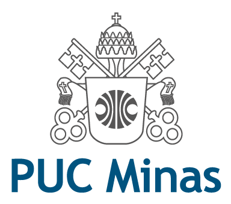

<h1 align="center">
    
</h1>

<h3 align="center">
  Laboratório de Desenvolvimento de Software - Projeto 2 - Sistema de Aluguel de veiculos
</h3>

Workspace do segundo modulo, da disciplina de Laboratório de Desenvolvimento De Software 🎓

  

  	
	

 

**Atividade:** Laboratório 2

**Grupo:** 8

**Alunos:**
- Arthur Bicalho
- Érika Márcia
- Guilherme Júlio
- Ítalo Lelis

---

## :card_index_dividers: Índice de diretórios

- [Diagramas UML](project/)
- [Código Implementado](implementation/)

## 🚗 Sobre o Laboratório

 
Neste laboratório, será projetado um sistema de alugel de veiculos.
 Mais informações podem ser visualizadas na <a href="https://pucminas.instructure.com/courses/70012/pages/sistema-de-aluguel-de-carros">descrição do sistema</a>.

 
 

## 📍️ Processo de Desenvolvimento

- Sprint 1: Modelagem do sistema: Diagrama de Casos de Uso, Diagrama de Classes, Diagrama de Componentes.

- Lab02S02: TBD;

- Lab02S03: TBD;

 

## :memo: Licença

Esse projeto está sob a licença MIT. Veja o arquivo [LICENSE](LICENSE) para mais detalhes.
